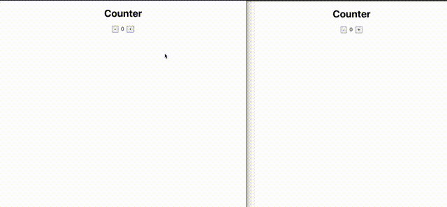

# Multi User Counter

## About

A counter app example that syncs across multiple sessions and is persistent to new connections.



---

## Getting Started

These instructions will get you a copy of the project up and running on your local machine.

---

## Prerequisites

- Node.js
- Free port 80

---

## Instructions

### 1. Clone this git repository

```
git clone https://github.com/syncstate/multi-user-counter-example.git
```

### 2. Install local npm dependencies

```
npm install
```

### 3. Run it

#### `In the project directory`

```
npm start/yarn start
```

Runs the app in the development mode.\
Open [http://localhost:3000](http://localhost:3000) to view it in the browser.

```
cd server
node index.js
```

Runs the server\
Open [http://localhost:8000](http://localhost:8000) to view it in the browser.
